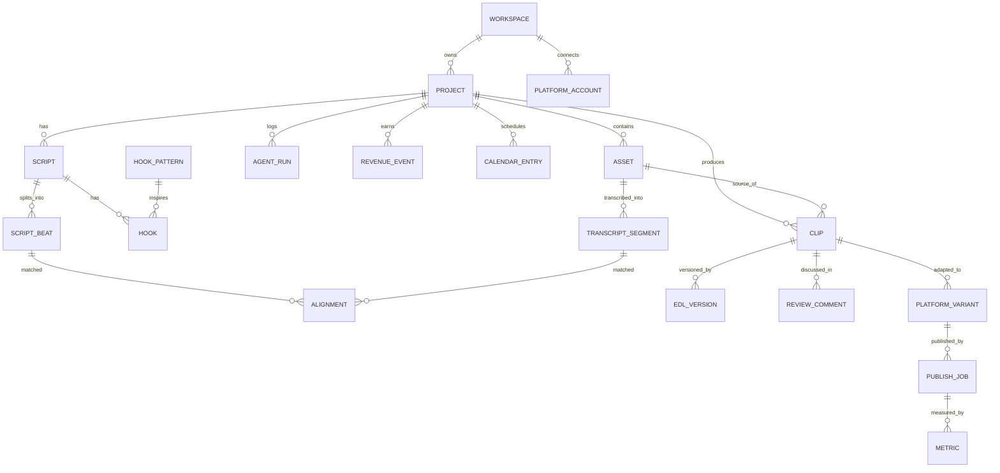

# Database Design: CreatorAi

> PostgreSQL on Supabase, accessed via Sequelize. Legend: ✅ exists today · ⏳ planned.

---

## 1. Overview

- **Engine:** PostgreSQL (Supabase pooler URL, SSL on)
- **ORM:** Sequelize (Node.js)
- **Extensions:** `uuid-ossp` / `pgcrypto` ✅, `vector` (pgvector) ⏳
- **IDs:** UUID primary keys
- **Timestamps:** `created_at`, `updated_at` on every table
- **Tenancy:** `workspace_id` on all user-owned tables ⏳, enforced with RLS

---

## 2. Entity Relationship Diagram



---

## 3. Current Tables ✅ (9 models)

| Model | Purpose | Key columns (current → planned additions) |
|---|---|---|
| `Project` | Content piece moving through the pipeline | `id`, `title`, `topic`, `status` enum, `niche` → add `workspace_id` |
| `Asset` | Uploaded file | `id`, `project_id`, `type` (video/audio/image), `filename`, `storage_path`, `size`, `duration` → add `mime`, `status` |
| `Script` | Generated or written script | `id`, `project_id`, `tone`, `content` → add `version`, `hook_pattern_id` |
| `Hook` | Hook option | `id`, `script_id`, `text`, `score` → add `pattern_id`, `category` |
| `TranscriptSegment` | Transcript chunk | `id`, `asset_id`, `start`, `end`, `text` → add `words` jsonb, `speaker`, `embedding` vector |
| `Clip` | Suggested short-form clip | `id`, `project_id`, `asset_id`, `start`, `end`, `score`, `reason` → add `status`, `hook_pattern_id`, `beat_id` |
| `EditProject` | Versioned EDL | `id`, `clip_id`, `version`, `edl` jsonb → migrates into `edl_versions` |
| `PublishJob` | Scheduled or sent post | `id`, `clip_id`, `platform`, `scheduled_at`, `status` → add `variant_id`, `external_id`, `error` |
| `Metric` | Performance snapshot | `id`, `publish_job_id`, `views`, `likes`, `comments`, `shares` → add `watch_time`, `captured_at`, `source` (real/seed) |

---

## 4. New Tables ⏳

### 4.1 Identity and Tenancy
**`workspaces`**
| Column | Type | Notes |
|---|---|---|
| id | uuid PK | Equals or references `auth.users.id` |
| email | text | |
| name | text | |
| niche | text | Used by ideation |
| tone_profile | jsonb | Voice, formality, banned words |
| created_at | timestamptz | |

**`platform_accounts`**
| Column | Type | Notes |
|---|---|---|
| id | uuid PK | |
| workspace_id | uuid FK | |
| platform | enum | `tiktok`, `reels`, `shorts`, `x`, `linkedin` |
| handle | text | |
| token_ref | text | Reference to secret store, never the raw token |
| status | text | `connected`, `simulated`, `expired` |

### 4.2 Script ↔ Footage Understanding
**`script_beats`**: `id`, `script_id` FK, `idx` int, `text`, `importance` (0–1), `embedding vector(384)`

**`alignments`**
| Column | Type | Notes |
|---|---|---|
| id | uuid PK | |
| beat_id | uuid FK | |
| segment_id | uuid FK nullable | Null means a gap |
| score | real | Cosine similarity 0–1 |
| status | enum | `matched`, `weak`, `gap` |

### 4.3 Editing
**`edl_versions`**
| Column | Type | Notes |
|---|---|---|
| id | uuid PK | |
| clip_id | uuid FK | |
| version | int | Increment per clip |
| edl | jsonb | Full document, see [`EDL_FORMAT.md`](./EDL_FORMAT.md) |
| created_by | enum | `ai`, `user` |
| parent_version | int | Lineage for revert |
| note | text | e.g. "Rejected trim op o2" |

**`review_comments`**: `id`, `clip_id` FK, `edl_version` int, `timecode` real, `author`, `body`, `resolved` bool

### 4.4 Publishing
**`platform_variants`**: `id`, `clip_id` FK, `platform`, `aspect`, `duration`, `caption`, `hashtags` text[], `asset_id` FK (rendered file), `status`

**`calendar_entries`**: `id`, `project_id` FK, `platform`, `planned_at`, `note`

### 4.5 Intelligence
**`hook_patterns`**
| Column | Type | Notes |
|---|---|---|
| id | uuid PK | |
| pattern | text | Template, e.g. "Most people get {topic} wrong because…" |
| category | text | `question`, `statement`, `story`, `stat`, `contrarian` |
| example | text | |
| source | text | Dataset origin |

**`revenue_events`**: `id`, `project_id` FK, `platform`, `amount` numeric, `currency`, `model` enum (`cpm`, `cps`, `tip`, `brand`, `other`), `occurred_on` date

### 4.6 Platform Operations
**`agent_runs`**: `id`, `project_id` FK, `agent` text, `input` jsonb, `output` jsonb, `status`, `started_at`, `ended_at`, `error`

**`jobs`**
| Column | Type | Notes |
|---|---|---|
| id | uuid PK | |
| type | text | `transcribe`, `embed`, `align`, `render`, `publish`, `metrics_sync` |
| payload | jsonb | |
| status | enum | `queued`, `running`, `succeeded`, `failed` |
| progress | int | 0–100 |
| attempts | int | |
| result | jsonb | |
| error | text | |

---

## 5. Enums

| Enum | Values |
|---|---|
| `project_status` | `idea`, `scripted`, `recorded`, `editing`, `review`, `scheduled`, `published` |
| `asset_type` | `video`, `audio`, `image`, `other` |
| `platform` | `tiktok`, `reels`, `shorts`, `x`, `linkedin` |
| `publish_status` | `queued`, `scheduled`, `published`, `failed` |
| `job_status` | `queued`, `running`, `succeeded`, `failed` |
| `clip_status` | `suggested`, `accepted`, `rejected`, `rendered` |
| `op_status` (inside EDL JSON) | `pending`, `accepted`, `rejected` |

---

## 6. Indexes

| Table | Index | Reason |
|---|---|---|
| `projects` | `(workspace_id, status)` | Dashboard pipeline |
| `assets` | `(project_id)` | Library views |
| `transcript_segments` | `(asset_id, start)` | Timeline lookup |
| `transcript_segments` | IVFFlat or HNSW on `embedding vector_cosine_ops` | Semantic search |
| `script_beats` | `(script_id, idx)` | Ordered beats |
| `edl_versions` | `UNIQUE (clip_id, version)` | Version integrity |
| `publish_jobs` | `(status, scheduled_at)` | Scheduler polling |
| `metrics` | `(publish_job_id, captured_at)` | Time series |
| `jobs` | `(status, created_at)` | Queue polling |

---

## 7. Row Level Security ⏳

Pattern (repeat for each user-owned table):

```sql
alter table projects enable row level security;

create policy "workspace members read own projects"
  on projects for select
  using (workspace_id = auth.uid());

create policy "workspace members write own projects"
  on projects for all
  using (workspace_id = auth.uid())
  with check (workspace_id = auth.uid());
```

Child tables inherit access by joining through `project_id`. The backend uses the service key and must always filter by `workspace_id` from the verified JWT.

---

## 8. Key Queries

**Hook performance by pattern (powers insights)**
```sql
select h.category,
       avg(m.views) as avg_views,
       avg((m.likes + m.comments + m.shares)::float / nullif(m.views,0)) as engagement
from metrics m
join publish_jobs pj on pj.id = m.publish_job_id
join clips c on c.id = pj.clip_id
join hook_patterns h on h.id = c.hook_pattern_id
group by h.category
order by engagement desc;
```

**Semantic footage search**
```sql
select id, asset_id, start, "end", text,
       1 - (embedding <=> $1) as similarity
from transcript_segments
where asset_id = any($2)
order by embedding <=> $1
limit 10;
```

**Script gaps**
```sql
select b.idx, b.text
from script_beats b
left join alignments a on a.beat_id = b.id and a.status = 'matched'
where b.script_id = $1 and a.id is null;
```

---

## 9. Migration Plan

| Step | Change |
|---|---|
| 1 | Enable `vector`; add `workspaces`, add `workspace_id` to `projects` |
| 2 | Add `script_beats`, `alignments`; add `embedding` and `words` to `transcript_segments` |
| 3 | Create `edl_versions`; backfill from `EditProject` |
| 4 | Create `platform_variants`, `platform_accounts`; add `variant_id` to `publish_jobs` |
| 5 | Create `jobs`, `agent_runs`, `hook_patterns`; seed hook patterns |
| 6 | Create `review_comments`, `revenue_events`, `calendar_entries` |
| 7 | Enable RLS and policies |

Keep `supabase/schema.sql` as the source of truth; add numbered migration files under `supabase/migrations/`.

---

## 10. Seed Data

| Seed | Purpose |
|---|---|
| `hook_patterns` (50–100 rows) | Few-shot retrieval for hook generation |
| Demo project with transcript | Offline demo without transcription |
| Metrics (30+ rows, flagged `source = 'seed'`) | Insights that work on day one |
| Demo revenue events | Revenue tracker view |
